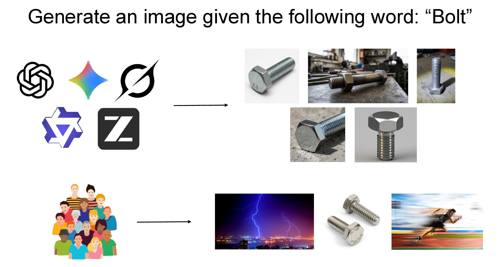

# Where did the ambiguity go? Examining how multimodal models interpret polysemous words

**Sci-FM @ COLM 2026 Oral**

[](https://arxiv.org/abs/2608.00410)
[](https://huggingface.co/datasets/addisonwu05/llm-polysemy-outputs)

[Jasin Cekinmez](https://jasincekinmez.github.io/)\*, [Addison J. Wu](https://addisonwu05.github.io/)\*, [Raja Marjieh](https://raja-marjieh.github.io/), [Thomas L. Griffiths](https://cocosci.princeton.edu/tom/index.php) — Princeton University

\*Equal contribution



A benchmark for how **text-to-image** and **text** models handle **polysemous words** — words
with several meanings (e.g. *bank*: finance or river, *bolt*: fastener or lightning). We give
each model just the **bare word**, with no context to fix the meaning, sample it many times, and
see which sense it lands on. Comparing those choices across models, model generations, families,
and both modalities, we find a clear **multimodal gap**: within every family, image models settle
on far fewer senses than text models, and both are far less varied than what people picture for
the same words.

---

## The pipeline (4 stages)

```
 generate  ─▶  classify  ─▶  histograms  ─▶  plot / compare
 (eval)        (judges)      (--histograms)   (plots/*)
```

1. **generate** — for each word, sample 30 outputs per model.
   - *image*: prompt = the bare word → a PNG.
   - *text*: prompt = `Use the following word in a single sentence: <word> / Reply with
     only the sentence and nothing else.` → a sentence.
2. **classify** — two judges (GPT + Gemini) label each output by which sense it uses.
3. **histograms** — aggregate the per-sample labels into per-(word, model, judge)
   sense distributions.
4. **plot / compare** — figures per word, per family, across generations, vs a
   text-frequency prior, and a cross-modality image-vs-text comparison.

Everything is driven by a single model registry (`llm_polysemy/registry.py`) — adding
a model is one row there.

## Setup

```bash
pip install openai google-genai python-dotenv tqdm numpy scipy scikit-learn matplotlib requests
# (pytrends only if you fetch Google Trends priors)
```

API keys live in `.env` (gitignored), gathered into per-provider pools **by prefix** —
add capacity by adding suffixed keys:

```
OPENAI_API_KEY=...        OPENAI_API_KEY_2=...     # OpenAI (GPT + gpt-image)
XAI_API_KEY=...                                    # xAI Grok
GEMINI_API_KEY=...                                 # Google Gemini
TOGETHER_API_KEY_QWEN=...                          # Qwen   (Together.ai)
TOGETHER_API_KEY_BF=...                            # FLUX   (Together.ai / Black Forest Labs)
```
A provider family runs exactly as many concurrent requests as it has keys.

## Reproduce from scratch (open models, no cluster required)

The five open-weight image models need **no API keys** — all weights download from the
Hugging Face Hub on first run and cache in `~/.cache/huggingface` (set `HF_HOME` to
relocate). Nothing is hardcoded to a cluster path; SLURM is optional.

**Requirements:** an NVIDIA GPU with ≥24 GB VRAM (SDXL and GLM-Image fit in less;
SimpleAR at 1024px is the heaviest), CUDA drivers, `git`, and `conda`.

**1. Clone and build the envs.** Two conda envs, because SimpleAR pins an older
`transformers` than GLM-Image needs:

```bash
git clone https://github.com/addisonwu05/llm-polysemy.git && cd llm-polysemy
bash models/glm-image/build_env.sh     # env 'glm'      -> SDXL + GLM-Image
bash models/simplear/build_env.sh      # env 'simplear' -> SimpleAR (also clones its
                                       #                  inference code, see below)
```

`build_env.sh` for SimpleAR clones `github.com/wdrink/SimpleAR` (pinned to commit
`d56b6e5c`) into `third_party/SimpleAR` — gitignored, and overridable with
`SIMPLEAR_REPO=/some/dir`. The generators find it automatically.

**2. Checkpoints.** Defaults are baked in; override any of them with the flag or env var:

| model_key | HF repo id | override |
|---|---|---|
| `sdxl_base` | `stabilityai/stable-diffusion-xl-base-1.0` | `--base-id` / `SDXL_BASE_ID` |
| `sdxl_dpo` | base above + UNet from `mhdang/dpo-sdxl-text2image-v1` (`subfolder="unet"`) | `--dpo-id` / `SDXL_DPO_ID` |
| `simplear_sft` | `Daniel0724/SimpleAR-1.5B-SFT` | `--ckpt` / `SIMPLEAR_SFT_ID` |
| `simplear_rl` | `Daniel0724/SimpleAR-1.5B-RL` | `--ckpt` / `SIMPLEAR_RL_ID` |
| (SimpleAR VQ decoder) | `nvidia/Cosmos-0.1-Tokenizer-DV8x16x16` | `--cosmos` / `COSMOS_ID` |
| `glm_image` | `zai-org/GLM-Image` | `--model-path` / `GLM_IMAGE_ID` |

None of these are gated — no license click-through, no HF token needed to download.

**3. Generate.** Plain Python, no SLURM. `--limit`/`--n` shrink the run for a smoke test;
omit both for the full 100 words × 30 samples:

```bash
conda activate glm
python -m llm_polysemy.gen_sdxl --variant base --limit 1 --n 1   # smoke: 1 image
python -m llm_polysemy.gen_sdxl --variant base                   # full 3000
python -m llm_polysemy.gen_sdxl --variant dpo
python -m llm_polysemy.gen_glm_image

conda activate simplear
python -m llm_polysemy.gen_simplear --variant sft
python -m llm_polysemy.gen_simplear --variant rl
```

Resume is filesystem-driven — rerun after an interruption and only missing files are
regenerated. `--shard i --num-shards N` splits the word list if you *do* have a scheduler
(the `models/*/run_*_array.slurm` scripts wrap exactly this).

**4. Classify → histograms → figures.** Needs `OPENAI_API_KEY` and `GEMINI_API_KEY`
(the two judges):

```bash
python -m llm_polysemy.classify --modality image --model sdxl_base   # per model, or omit --model for all
python -m llm_polysemy.classify --modality image --histograms        # -> data/histograms_image.json
python -m llm_polysemy.plots.similarity --modality image             # figures/ (any module under plots/)
```

## Commands

All commands take `--modality {image,text}` and run as `python -m
llm_polysemy.<entrypoint>` (e.g. `python -m llm_polysemy.eval --modality image`).

### Generate

```bash
python -m llm_polysemy.eval --modality image                 # all image models
python -m llm_polysemy.eval --modality text                  # all text models
python -m llm_polysemy.eval --modality text --model openai_55 # one model
python -m llm_polysemy.eval --modality text --lang tr        # Turkish word list + Turkish prompt
python -m llm_polysemy.eval --modality text-imagine          # text models, "what image comes to mind?" (en only)
```
Resume is automatic & filesystem-driven: only missing outputs are regenerated
(delete an output file to re-queue just that sample).

**GLM-Image (local diffusion text-to-image, image modality only).** A local GPU model
with no API path, so it does **not** go through `eval` — it has its own generator that
writes into the same canonical layout, and it's a true text-to-image diffusion model
(diffusers `GlmImagePipeline`), so the prompt is the **bare word** (no
instruction wrapper). Writes `outputs_image/<word>/glm_image/`, model key `glm_image`.
Needs the `glm` conda env (official git `transformers`+`diffusers`), built via
`models/glm-image/build_env.sh`; weights at `models/glm-image/`. Run it on a della GPU
node, not the login node:
```bash
sbatch models/glm-image/run_glm_array.slurm        # one job per word (100-task array)
python -m llm_polysemy.gen_glm_image --limit 3 --n 1   # smoke test (in the `glm` env, on a GPU)
```
Then classify with the normal `classify --modality image` (judges discover the
`glm_image` dirs on disk).

**RLHF ablation pairs (local GPU, image modality).** Two base-vs-RLHF model pairs
where the *only* difference between the two members is the preference/RL tuning stage,
so the change in sense selection isolates the effect of RLHF:

| pair | base key | tuned key | env | what differs |
|------|----------|-----------|-----|--------------|
| SDXL Diffusion-DPO | `sdxl_base` | `sdxl_dpo` | `glm` | UNet swapped for the DPO-tuned UNet |
| SimpleAR | `simplear_sft` | `simplear_rl` | `simplear` | full checkpoint after the RL stage |

Each runs as a 100-task per-word array (`--variant` picks the member); both members
share identical sampler/VQ/prompt so the diff is purely the weights:
```bash
sbatch models/sdxl/run_sdxl_array.slurm       {base,dpo}
sbatch models/simplear/run_simplear_array.slurm {sft,rl}
# smoke (inside the matching conda env, on a GPU):
python -m llm_polysemy.gen_simplear --variant rl --limit 2 --n 1
```
SimpleAR is a Qwen2-based AR model + the NVIDIA **Cosmos** VQ decoder. All weights come
from the Hub on first run (see *Reproduce from scratch* below); its env is built via
`models/simplear/build_env.sh`, which also clones the SimpleAR inference code
(transformers is pinned to the repo's git commit — it imports `LogitsWarper`, removed in
newer releases). Classify all four keys with the usual
`classify --modality image --model KEY` then `--histograms`.

**Languages (`--lang {en,tr,fr}`, default `en`).** `en` uses `data/synonyms.txt`
(100 words) with the English prompt and the original output paths. `tr` / `fr`
use `data/synonyms_{tr,fr}.txt` (25 words each) with a Turkish / French generation
prompt and write to **`_<lang>`-suffixed** paths (`outputs_text_tr/`,
`histograms_text_fr.json`, senses from `data/meanings_<lang>.json`) so the languages
never collide. The image prompt is the bare word, so it's already language-correct.
Pass the same `--lang` to `classify`. For `tr`, the default run **drops the Qwen and
FLUX families** (`LANG_EXCLUDE_FAMILIES` in `llm_polysemy/eval.py`) — image `tr` runs 10 models,
text `tr` runs 12; `fr` currently runs all families. An explicit `--model KEY` still
runs any single model.

**`--modality text-imagine`** is a third generation condition (English only): the
same text models, but prompted *"What image comes to mind when you think of the word
`<word>`? Describe it briefly."* — the verbatim wording of the human Prolific `image`
survey. It's a framing-matched control: holding the substrate fixed (still an LLM) it
isolates *task framing* (depict vs use-in-a-sentence) from *modality*, so its sense
distribution (`histograms_text_imagine.json`) is directly comparable to both the human
`image` baseline and the real image models. Outputs/logs use `_text_imagine` paths.

### Classify

```bash
python -m llm_polysemy.classify --modality image                       # both judges
python -m llm_polysemy.classify --modality text --word bank --n 1      # cheap test slice
python -m llm_polysemy.classify --modality image --judge gemini        # one judge
python -m llm_polysemy.classify --modality image --histograms          # build histograms
python -m llm_polysemy.classify --modality text  --histograms
python -m llm_polysemy.classify --modality text-imagine                # classify the imagine run
python -m llm_polysemy.classify --modality text-imagine --histograms   # -> histograms_text_imagine.json
python -m llm_polysemy.classify --modality text --lang tr              # classify the Turkish run
python -m llm_polysemy.classify --modality text --lang tr --histograms
```

### Human baseline (Prolific) classification

Classify the human Prolific responses (`data/human_responses.json`, the same
100-word English panel) with the **same GPT + Gemini judges**, in two conditions
that mirror the LLM modalities — `meaning` (used the word in a sentence ≈ text)
and `image` (described the image it evokes ≈ image). Human-framed judge prompts
live in `prompts.human_*`; senses come from `data/meanings.json`.

```bash
python -m llm_polysemy.classify_human --convert            # human_responses.json -> file tree
python -m llm_polysemy.classify_human --condition both     # classify (both judges)
python -m llm_polysemy.classify_human --histograms         # -> histograms_human_{meaning,image}.json
```
`histograms_human_meaning.json` / `histograms_human_image.json` are directly
comparable to `histograms_text.json` / `histograms_image.json`.

### Inter-judge agreement

```bash
python -m llm_polysemy.agreement --modality image      # raw agreement + Cohen's kappa
```

### Plots

Each plot accepts `--modality {image,text}` and `--judge {gpt,gemini,consensus}`
(default `gpt`); figures land under `figures/<modality>/` (or `figures/cross/`):

```bash
python -m llm_polysemy.plots.histograms        --modality image          # per-word sense bars
python -m llm_polysemy.plots.temporal          --modality image          # per-family, across generations
python -m llm_polysemy.plots.similarity        --modality image          # JS similarity matrix + family cohesion
python -m llm_polysemy.plots.pca_tsne          --modality image          # PCA / t-SNE of model distributions
python -m llm_polysemy.plots.word_disagreement --modality image          # most agreed / disagreed words
python -m llm_polysemy.plots.vs_textfreq       --modality text --prior manual   # vs a text-frequency prior
python -m llm_polysemy.plots.generation_trend  --modality text --prior manual   # prior alignment vs generation
python -m llm_polysemy.plots.cross_modality    --agg mean                # image-vs-text per family (needs both)
```

### Frequency priors (for the `vs_textfreq` / `generation_trend` plots)

```bash
python -m llm_polysemy.freq.build_freq                       # hand-curated -> data/freq_manual.json
python -m llm_polysemy.freq.fetch_freq --source wiki         # Wikipedia views -> data/freq_wiki.json
python -m llm_polysemy.freq.fetch_freq --source trends       # Google Trends  -> data/freq_trends.json
```

### Fetch the published outputs (reproduce without a GPU)

Don't want to regenerate the corpus? Pull the published images/text straight from the
Hub into the local layout, then run the rest of the pipeline (classify → histograms →
figures) with no GPU:

```bash
./scripts/download_dataset.sh image            # or: text, human_image, image_tr, text_imagine, ...
./scripts/download_dataset.sh image --dry-run  # print the plan, download nothing
./scripts/download_dataset.sh --all            # every sector
```

`download_dataset.sh` is the inverse of `upload_dataset.sh`: it pulls the sector(s) for the
requested modality from `addisonwu05/llm-polysemy-outputs` (override with `HF_REPO=`) and
remaps them back to `data/outputs_<mod>/<word>/<model>/` (hard-linked from the HF cache, so
no duplication). The `05_ablations/preference_tuning` sector is remapped under
`data/outputs_image/` automatically. Then:

```bash
python -m llm_polysemy.classify --modality image               # judge labels
python -m llm_polysemy.classify --modality image --histograms  # aggregate -> data/histograms_image.json
# then the plots (see Plots above) reproduce the paper figures.
```

### Publish the corpus

```bash
./scripts/upload_dataset.sh image              # or: text, human_image, image_tr, text_imagine, ...
./scripts/upload_dataset.sh image --dry-run    # print the routing plan, upload nothing
./scripts/upload_dataset.sh --all              # every sector present locally
```

Uploads to the HF dataset `addisonwu05/llm-polysemy-outputs` (override with `HF_REPO=`).

The dataset is organized into numbered **sectors**, not flat `outputs_*` dirs, and
`hf upload-large-folder` has no `--path-in-repo` flag — it mirrors relative paths to the
repo root. So the script stages a tree whose relative paths *are* the target repo paths
(using hard links, so the ~20 GB corpus is not duplicated) and uploads that root:

| local | repo sector |
|---|---|
| `data/outputs_image` | `01_main_english/image` |
| `data/outputs_text` | `01_main_english/text` |
| `data/outputs_human_{image,meaning}` | `02_human_baseline/{image,meaning}` |
| `data/outputs_{image,text}_tr` | `03_cross_lingual/turkish/{image,text}` |
| `data/outputs_{image,text}_fr` | `03_cross_lingual/french/{image,text}` |
| `data/outputs_text_imagine` | `04_stated_vs_revealed/text_imagine` |

Within the image modality, model keys are routed by the lists at the top of the script:
`sdxl_base`, `sdxl_dpo`, `simplear_sft`, `simplear_rl` go to
`05_ablations/preference_tuning/` instead of the main panel. Run `--dry-run` first
to confirm the routing. Uploads are resumable — re-running skips committed files, and the
Hub's 429 rate-limit messages are normal back-off, not failures.

## What you get (artifacts)

All generated data lives under `data/`, all figures under `figures/`:

| Path | What |
|---|---|
| `data/outputs_image/<word>/<model>/<NN>.png` | generated images |
| `data/outputs_text/<word>/<model>/<NN>.txt` | generated sentences |
| `data/outputs_text_imagine/<word>/<model>/<NN>.txt` | `text-imagine` mental-image descriptions (en) |
| `data/results_{image,text,text_imagine}.json` | per-sample generation status log |
| `data/classifications_{image,text,text_imagine}.json` | per-sample judge labels |
| `data/histograms_{image,text,text_imagine}.json` | aggregated sense distributions |
| `data/meanings.json` | candidate senses per word |
| `data/synonyms.txt` | the word list (first 100 used) |
| `data/synonyms_{tr,fr}.txt` | Turkish / French word lists (25 words each, `--lang {tr,fr}`) |
| `data/meanings_{tr,fr}.json` | Turkish / French candidate senses (English glosses for the judges + `meaning_<lang>`) |
| `data/{outputs,results,classifications,histograms}_*_{tr,fr}.*` | non-English run artifacts (`_<lang>` suffix) |
| `data/freq_{manual,wiki,trends}.json` | text-frequency priors |
| `figures/{image,text}/...` | per-modality figures |
| `figures/cross/...` | cross-modality (image vs text) figures |

## Adding a model

Add **one `ModelSpec` row** to `llm_polysemy/registry.py` (key, api_id, family,
modality, label, generation_index). Everything else — pools, concurrency, dispatch,
plot lists, family grouping, colors — derives from it. If you add a brand-new provider
family, also add its entry to `FAMILY_PROVIDER` (SDK / base_url / key prefix).

## Layout

```
llm_polysemy/          # the package — everything importable
  registry.py        # SINGLE SOURCE OF TRUTH: every model + families/colors/gen-order
  config.py          # Modality config objects (image vs text) + JUDGES
  keys.py            # API-key pools (prefix-gathered, round-robin)
  meanings.py schemas.py prompts.py histograms.py agreement.py
  plotting_utils.py  # shared plot helpers + judge resolver
  runner.py          # async engine (generation + classification)
  eval.py classify.py # merged --modality entrypoints
  gen_sdxl.py gen_simplear.py gen_glm_image.py   # open-model generators (weights from HF)
  providers/         # openai_sdk.py, google_genai.py
  plots/             # modality-aware plots + cross_modality.py
  freq/              # build_freq.py, fetch_freq.py  (text-frequency priors)
models/              # per-model SLURM/run scripts for the open generators
notebooks/           # analysis.ipynb, paper_figures.ipynb, FIGURE_GUIDE.md
scripts/             # upload_dataset.sh, download_dataset.sh
docs/                # static GitHub-Pages human-baseline study app
data/  figures/
```

There is no test suite or build step — this is a research/eval repo.
